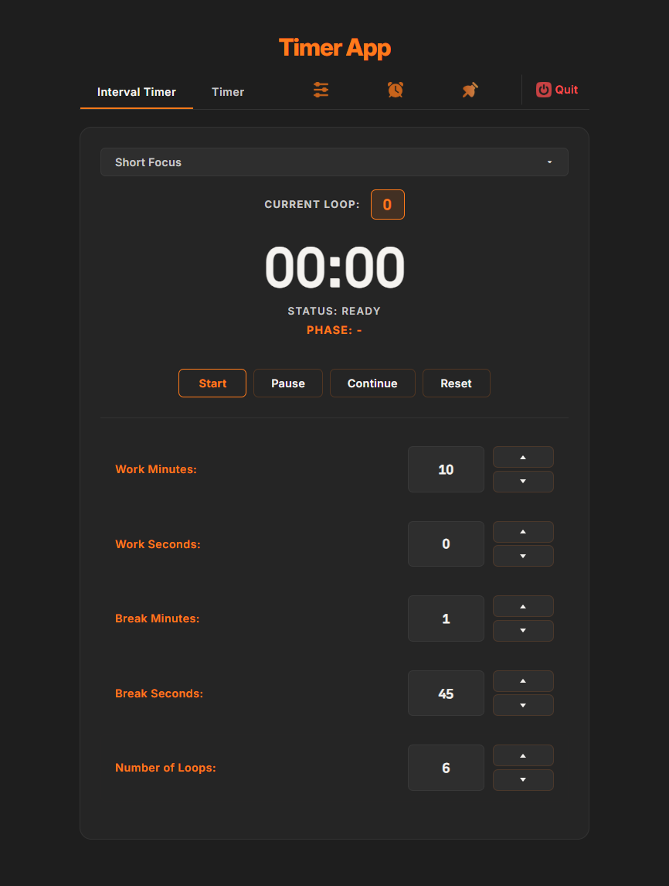

# Interval Timer

A desktop interval/countdown timer for Windows, built with Electron. Designed for
work/break cycles (Pomodoro-style), with alarms that can play a local sound file,
a YouTube video, or a Spotify track.

**[Download the latest release](https://github.com/psymore/interval-timer/releases/latest)** · [Landing page](https://psymore.github.io/interval-timer/)

## Screenshot

<p align="center">
  
</p>

## Features

- **Interval Timer** — configurable work/break durations and loop count, with a running phase/status display.
- **Countdown Timer** — a simple one-shot timer, separate from the interval loop.
- **Presets** — save and switch between named timer configurations; three seeded defaults plus up to 20 of your own.
- **Alarm sources** — a local audio file, a YouTube video/URL, or a Spotify track, with automatic fallback to the local alarm if a source fails to load or play.
- **Pause / Continue** — every alarm source resumes correctly rather than losing its duration cap or restarting from zero.
- **Mini window** — a small always-on-top window that mirrors and controls the active timer, and stays above other apps even when they go fullscreen.
- **System tray** — runs in the tray; keeps ticking in the background thanks to disabled timer throttling and a power-save blocker.

## Installation

### Download (recommended)

Grab the installer from the [latest release](https://github.com/psymore/interval-timer/releases/latest) and run it. No Node.js or build tools required.

### Build from source

```bash
git clone https://github.com/psymore/interval-timer.git
cd interval-timer
npm install
npm start          # run the app (electron .)
```

Other scripts:

```bash
npm run dist        # clean dist/ and build a Windows x64 installer (nsis)
npm run build        # clean dist/ and package with electron-builder
npm run clean        # remove dist/
```

There is no test suite or lint script configured.

#### Spotify alarms (optional, source builds only)

Spotify alarm support needs your own Spotify app credentials. Copy `spotify-credentials.example.json` to `spotify-credentials.json` and fill in the client ID/secret from the [Spotify Developer Dashboard](https://developer.spotify.com/dashboard). This file is gitignored and never bundled into releases.

## Project structure

```
interval-timer/
├── main.js                          # Electron main process — windows, tray, local HTTP server, Spotify OAuth
├── preload.cjs                      # contextBridge bridge exposing window.electronAPI
├── index.html / mini.html           # Renderer entry points (main window / always-on-top mini window)
├── css/styles.css
├── js/
│   ├── logic/                       # Pure timer state machines (Timer.js, IntervalTimer.js)
│   ├── alarm/
│   │   ├── AlarmManager.js          # Singleton entry point — source-agnostic
│   │   ├── AlarmProviderFactory.js  # Detects source type, builds the right provider
│   │   └── providers/               # Local / YouTube / Spotify implementations
│   ├── views/                       # DOM templates for each tab
│   ├── renderer.js, timer.js, intervalTimer.js, mini.js, presets.js, tabs.js, ...
├── docs/                            # GitHub Pages landing page (served from /docs on main)
└── build/                           # electron-builder assets (app icon)
```

## License

ISC — see the `license` field in `package.json`.

## Contributing

Issues and pull requests are welcome.
